::: column-margin

:::

[Zotero](https://www.zotero.org/) --- бесплатное программное обеспечение с открытым исходным кодом для управления библиографическими данными и сопутствующими исследовательскими материалами, такими как файлы PDF и ePUB. Среди функций --- интеграция с веб-браузером, онлайн-синхронизация, создание внутритекстовых ссылок, сносок и библиографий, встроенные средства чтения PDF, ePUB и HTML с возможностью добавления аннотаций, редактор заметок, а также интеграция с текстовыми редакторами.

::: column-page-right
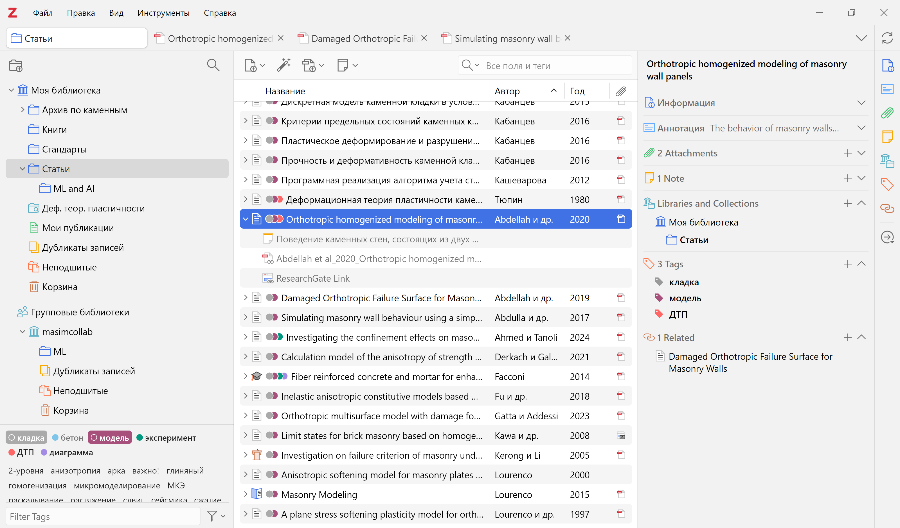{#fig-zotero}
:::

## Организация данных в Zotero

Перед тем, как перейти к практическому описанию организации совместной работы над литературой внутри исследовательской группы, рассмотрим, как Zotero организует библиографические данные.

Доступно два типа библиотек (см. левую панель на @fig-zotero):

-   **Моя библиотека (My Library)** -- личная библиотека каждого пользователя. Источники из этой библиотеки не доступны другим пользователям.
-   **Групповые библиотеки (Group Libraries)** -- библиотеки, созданные для совместной работы над литературой внутри исследовательской группы. Источники из этих библиотек видны всем участникам внутри группы.

Все источники *Item* в каждой библиотеке могут быть организованы в коллекции и подколлекции. Коллекции *Collection* -- это просто способ организации источников, в отличие от классических папок один и тот же источник может находиться в нескольких коллекциях одновременно без дублирования данных. Например, на @fig-0 источник *Item 4* находится одновременно в двух коллекциях: *Collection 1* и *Collection 3*.

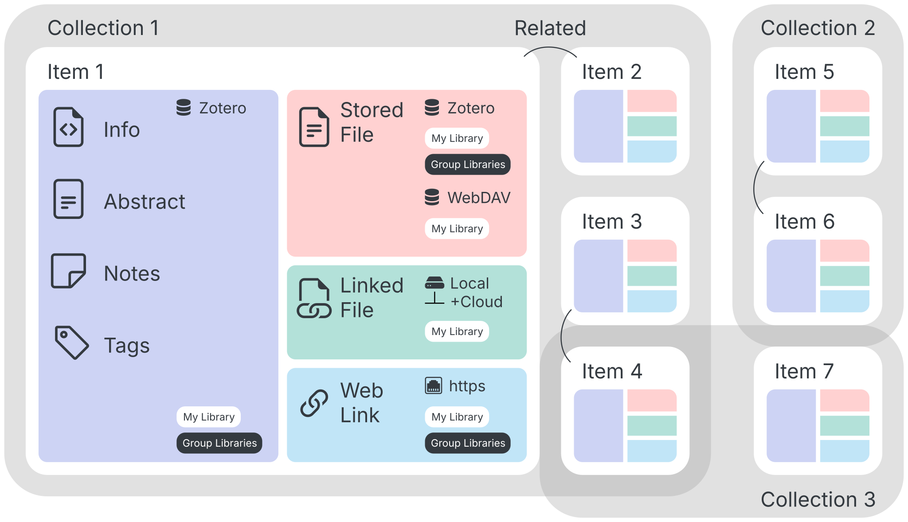{#fig-0}

В Zotero данные каждого источника состоят из двух частей:

-   **Метаданные** --- информация об источнике, такая как автор, название, год издания, журнал, том, номер страницы и т.д.
-   **Вложенные файлы** --- файлы, связанные с источником, такие как PDF-версии статей, изображения и другие документы.

Все метаданные источников (в том числе *Info, Abstract, Notes, Tags, Related* --- ccылки на другие источники в библиотеке) хранятся в базе данных на сервере Zotero и синхронизируются между всеми вашими устройствами, где установлена программа. Объем хранения метаданных неограничен и бесплатен как в Моей библиотеке, так и в Групповых библиотеках.

Вложенные файлы могут храниться тремя способами:

-   **Stored File** --- сохраненные файлы, доступны два варианта хранения:
    -   на сервере Zotero (бесплатно [300 МБ](https://www.zotero.org/storage)).
    -   на стороннем WebDAV-сервере (объем зависит от провайдера WebDAV).
-   **Linked File** --- внешние ссылки на файлы на вашем компьютере.
-   **Web Link** --- ссылки на интернет-ресурсы (объем неограничен и бесплатен).

В *Моей библиотеке* вы можете использовать все три способа хранения вложенных файлов.

В *Групповых библиотеках* Zotero хранит только метаданные источников, а вложенные файлы сохраняет как *Stored File* на своем сервере или *Web Link*. Вложенные файлы, сохраненные как *Linked File*[^1] и сохраненные файлы на *WebDAV-сервере* в *Групповых библиотеках* не поддерживаются.

[^1]: Этой проблеме посвящено обсуждение на форуме [Linked files disabled in group libraries](https://forums.zotero.org/discussion/128925/linked-files-disabled-in-group-libraries#latest). На момент чтения статьи такая возможность может быть реализована.

Мотивация этой статьи заключается в том, чтобы в *Моей библиотеке* обойти ограничение в 300 МБ с использованием двух доступных технологий: *Stored File c WebDAV-сервером* и/или *Linked File* для хранения вложенных файлов на компьютере с использованием облачного сервиса.

::: {.callout-tip appearance="simple"}
Рекомендуется использовать *WebDAV*, т.к. при этом файлы синхронизируются автоматически и доступны на всех устройствах без ручной настройки одинаковых путей, также меньше риск «потерять» вложения из-за переименования файлов или смены путей.

Связанные файлы *Linked File* дают больше ручного контроля, но требуют внимания, при этом пути к файлам должны быть одинаковыми на всех устройствах, если вы планируете работать с ними на разных компьютерах.
:::

В @tbl-data для примера приведен неполный перечень облачных сервисов, которые можно использовать для хранения вложенных файлов с указанием бесплатного объема и поддержки протокола *WebDAV*.

| Облачный сервис | Страна | Бесплатный объем, ГБ | Поддержка WebDAV |
|-----------------|--------|----------------------|------------------|
| TeraBox         | en     | 1024                 | ❌               |
| InfiniCLOUD     | en     | 20                   | ✅               |
| Google Drive    | en     | 15                   | ❌               |
| СберДиск        | ru     | 15                   | ❌               |
| Koofr           | en     | 10                   | ✅               |
| Облако Mail.ru  | ru     | 8                    | ✅               |
| iCloud Drive    | en     | 5                    | ❌               |
| OneDrive        | en     | 5                    | ❌               |
| Яндекс Диск     | ru     | 5                    | ✅               |
| Dropbox         | en     | 2                    | ❌               |

: Облачные сервисы {#tbl-data}

Далее описана процедура регистрации и настройки Zotero, в том числе настройки для подключения *WebDAV-сервера* на примере *Облако Mail.ru* и/или сохранения вложенных файлов *Linked File* с использованием *Google Drive*.

## Регистрация в Zotero и создание групп

Создайте аккаунт [Zotero](https://www.zotero.org/) для каждого участника исследовательской группы, а также по желанию создайте групповой аккаунт, чтобы расширить объем хранилища для [Групповых библиотек](#zotero-groups).

### Установка и настройка приложения

Скачайте приложение [Zotero](https://www.zotero.org/download/) на свой компьютер.

Перейдите по пути *Правка → Настройки → Синхронизация*. В разделе *Синхронизация данных* войдите в свою учетную запись Zotero.

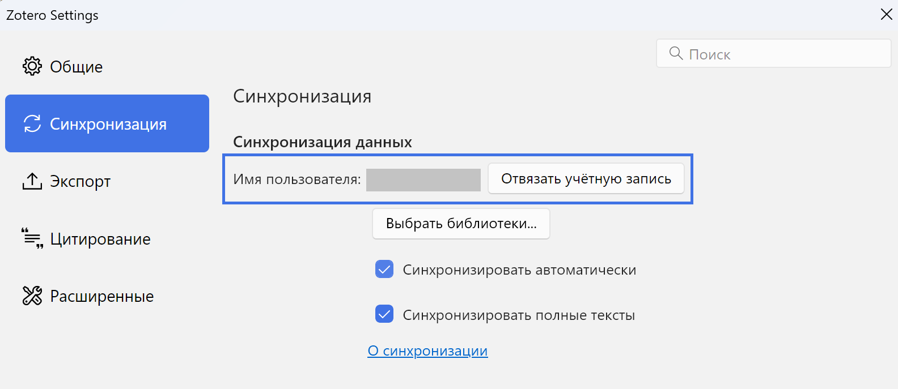{#fig-9}

Zotero может автоматически переименовывать файлы (например, pdf-файлы статей) по заданному шаблону. Для этого перейдите по пути *Правка → Настройки → Общие*, раздел *File Renaming*, кнопка *Customize Filename Format*. Например, можно использовать следующий шаблон:

`{{ firstCreator suffix="_" }}{{ year suffix="_" }}{{ title truncate="100" }}`.

Пример имени файла по такому шаблону: *Baraldi et al_2021_Laboratory and numerical experimentation for masonry in compression.pdf*.

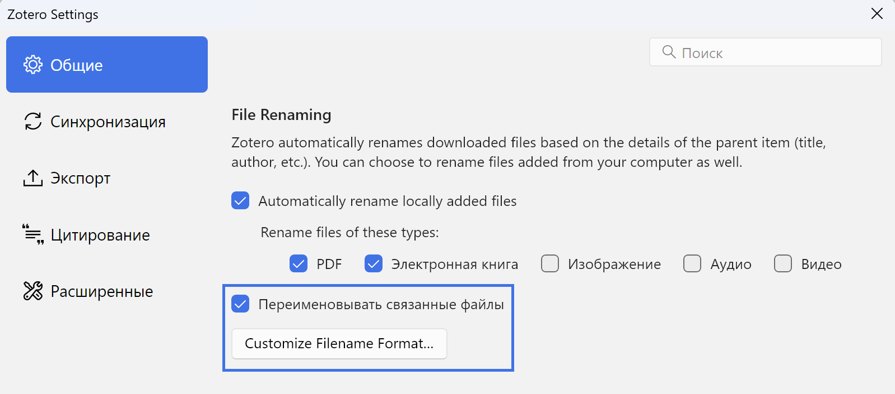{#fig-16}

### Настройка групповых библиотек {#zotero-groups}

Для совместной работы с источниками и их цитирования внутри исследовательской группы в Zotero можно создать соответствующие групповые библиотеки и добавить в них участников. Группы можно создавать с аккаунта каждого участника. Для этого в приложении перейдите по пути: *Файл → Новая библиотека → Новая группа*, вас перебросит на официальный сайт Zotero. Заполните имя группы *Choose a name for your group → Group Type → Create Group.*

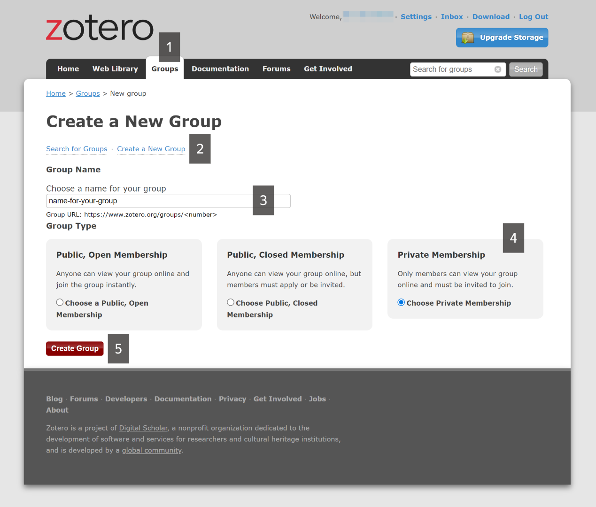{#fig-7}

Доступно три варианта групп:

-   **Public, Open Membership** --- любой желающий может просмотреть вашу группу онлайн и мгновенно присоединиться к ней.
-   **Public, Closed Membership** --- любой желающий может просмотреть вашу группу онлайн, но участники должны подать заявку или быть приглашены.
-   **Private Membership** --- только участники могут просматривать вашу группу онлайн и должны быть приглашены присоединиться к ней.

Далее добавьте участников в группу. Для этого во вкладке *Groups* у созданной группы перейдите в *Manage Members*, затем в разделе *Member Invitations* нажмите *Send More Invitations* и внесите список адресов электронной почты или имена пользователей Zotero, разделяя их запятыми или записывая с новой строки. После этого нажмите *Invite Members*.

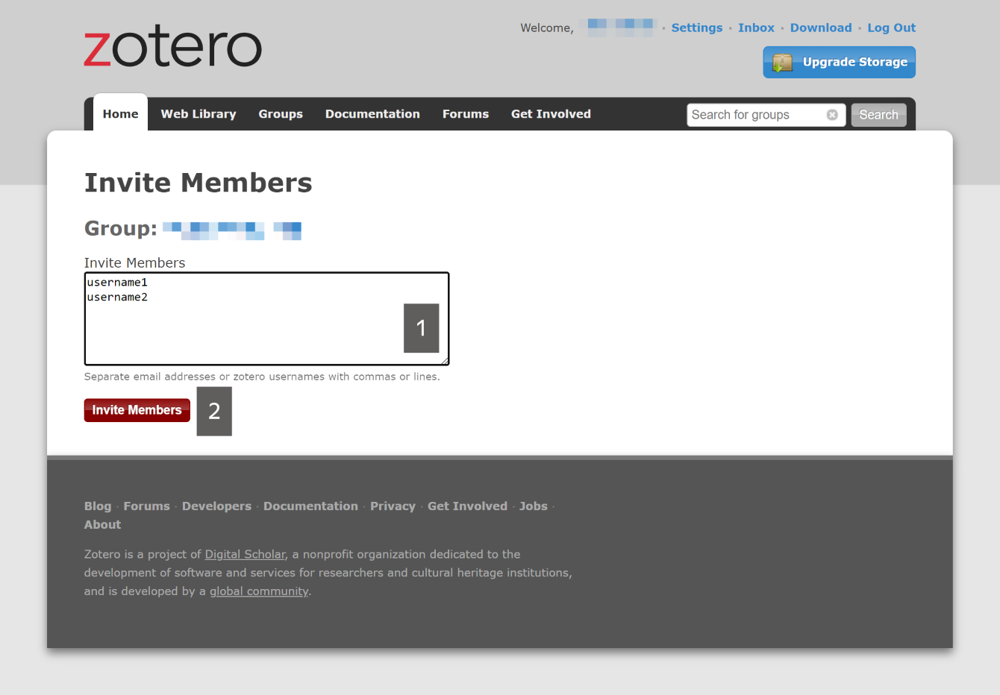{#fig-8}

Каждому участнику придет приглашение на электронную почту. Требуется подтвердить свое согласие на вступление в группу. После этого в главном окне программы Zotero отобразятся *Групповые библиотеки* (см. левую панель на @fig-zotero).

::: {.callout-tip appearance="simple"}
Если у вас не отображаются *Групповые библиотеки*, проверьте добавили ли вас в группу и подтвердили ли вы свое вступление в нее.
:::

## Настройка WebDAV на примере Облако Mail.ru

Для использования WebDAV-сервера в Zotero требуется зарегистрироваться на стороннем сервисе, предоставляющем такую услугу. В нашем случае мы используем [Облако Mail.ru](https://cloud.mail.ru/), предоставляющее 8 ГБ бесплатного дискового пространства.

### Создание пароля

В параметрах аккаунта Mail.ru перейдите в раздел [*Безопасность*](https://id.mail.ru/security) *→ Пароли для внешних приложений*.

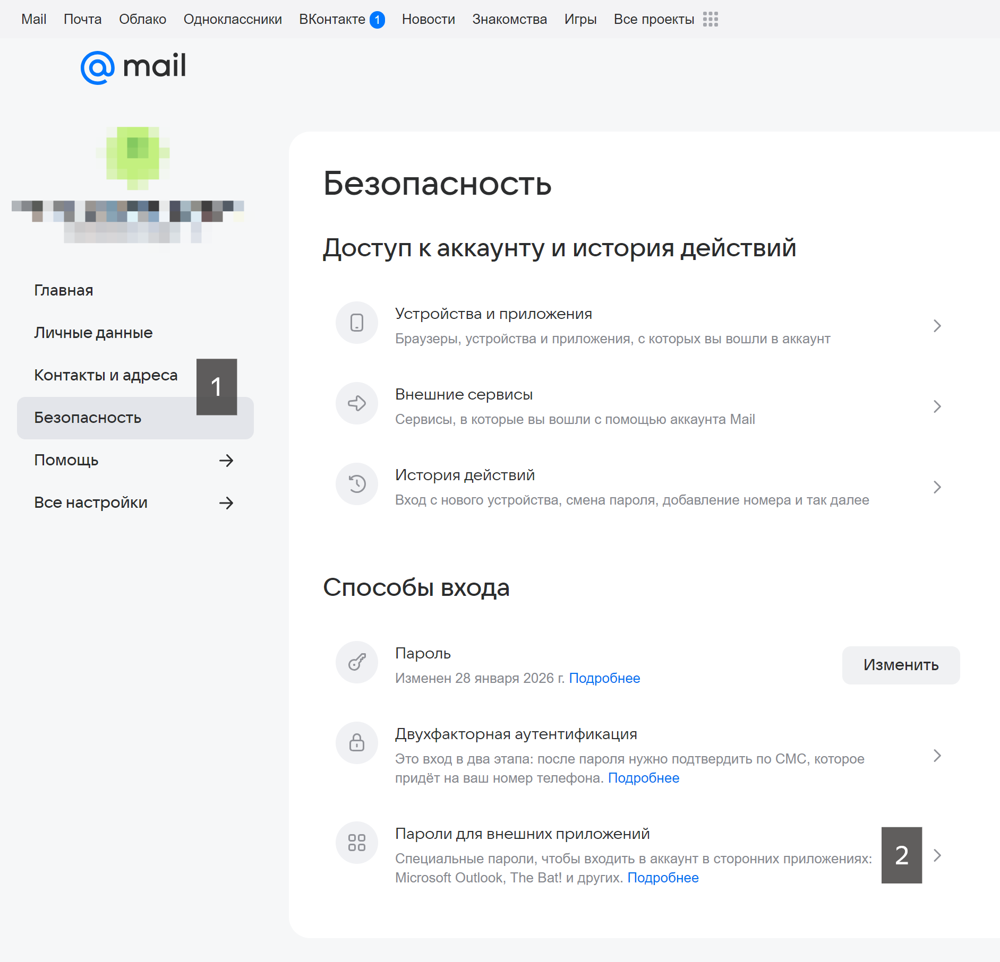{#fig-11}

Укажите название для пароля, например, `Zotero-WebDAV`, затем в качестве типа протокола выберите *Полный доступ к Облаку* и нажмите *Продолжить*.

::: column-page-right
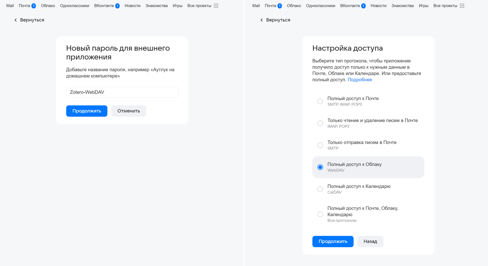{#fig-12}
:::

Потребуется подтвердить действие паролем вашего аккаунта, после чего будет сгенерирован пароль для доступа к WebDAV-серверу --- *скопируйте его*.

### Настройка в Zotero

Перейдите в Zotero по пути *Правка → Настройки → Синхронизация*. В разделе *Синхронизация файлов* в пункте *«Синхронизировать вложенные файлы в Моей библиотеке, используя»* выберите *WebDAV*.

Укажите *URL-адрес сервера WebDAV*: `webdav.cloud.mail.ru` → *Имя пользователя*: ваш адрес электронной почты на Mail.ru → *Пароль*: вставьте скопированный ранее пароль для внешних приложений → *Проверить сервер*.

Оставляем активным чекбокс *Синхронизировать вложенные файлы в групповых библиотеках, используя хранилище Zotero*.

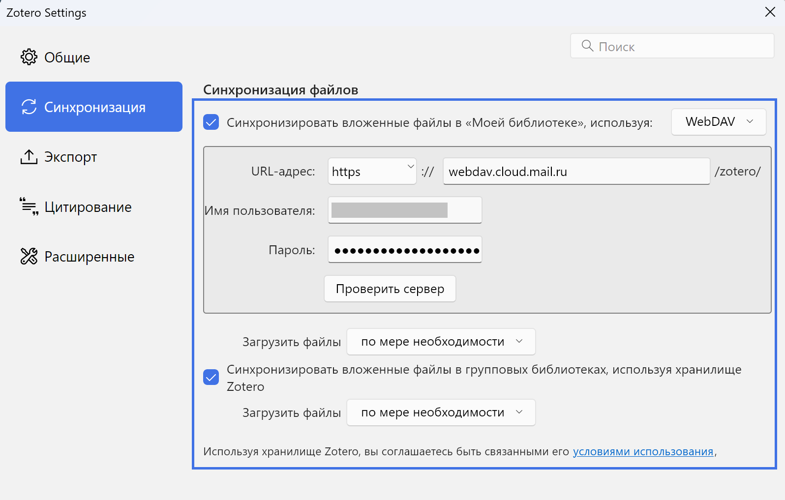{#fig-13}

::: {.callout-tip appearance="simple"}
Переключатели *Загрузить файлы* позволяют настроить тип синхронизации вложенных файлов:

-   **во время синхронизации** с загрузкой всех вложенных файлов.
-   **по мере необходимости** с загрузкой вложенных файлов при первой попытке их открытия, что полезно для экономии места на диске.
:::

## Настройка Linked File с использованием Google Drive

Альтернативой технологии *WebDAV* является использование внешних ссылок *Linked File*. В этом разделе описан способ сохранения файлов как внешних ссылок в папку на компьютере, синхронизированную с Google Drive, предоставляющего 15 ГБ бесплатного дискового пространства.

### Регистрация и настройка Google Drive

Создайте Google-аккаунт и перейдите в Google Drive. Далее в корне диска создайте папку References, в которой будут храниться все источники.

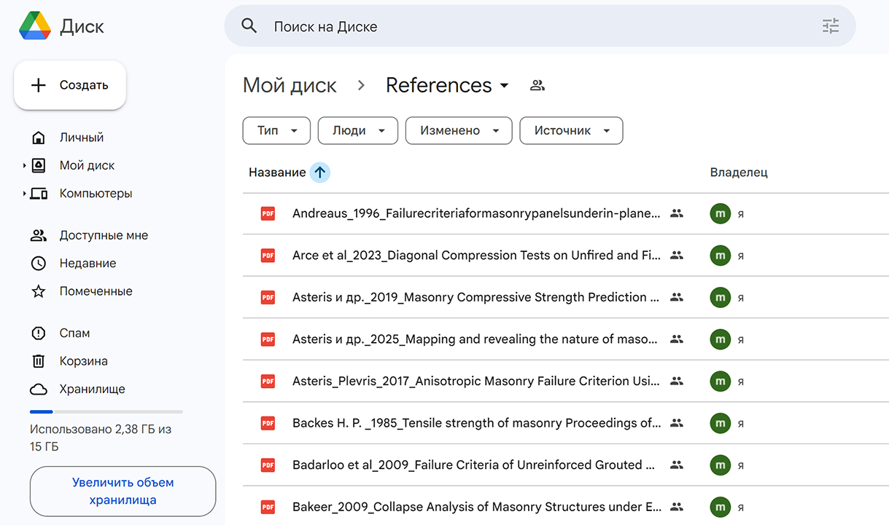{#fig-1}

Далее установите на свой рабочий компьютер приложение [Google Drive](https://workspace.google.com/intl/ru/products/drive/?from=gafb-drive-global_nav-ru#download) и войти в свой аккаунт. В проводнике среди физических дисков должен появиться виртуальный диск *(G:)*, в котором по пути *G:\\Мой диск* будет находиться папка *References*.

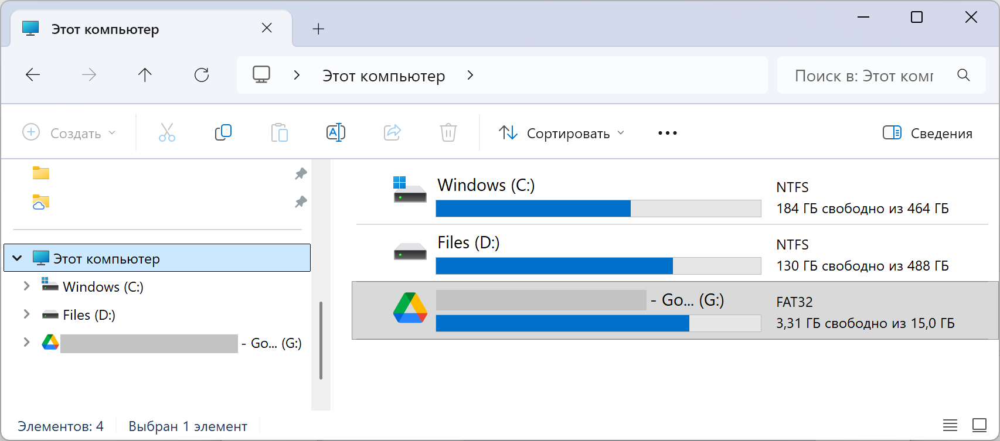{#fig-6}

### Настройка связанных вложенных файлов

В Zotero перейдите по пути *Правка → Настройки → Расширенные*. В разделе *Базовая папка связанных вложений* укажите в качестве *Базовой папки* ссылку на папку *References*. Zotero будет использовать значения относительных путей для связанных вложенных файлов в базовой папке, обеспечивая доступ к файлам на других компьютерах.

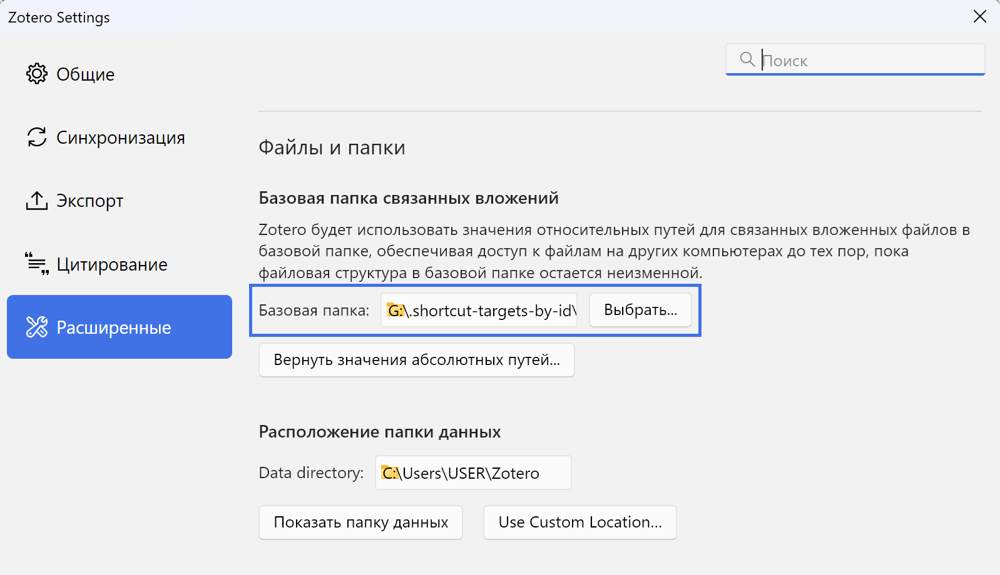{#fig-15}

Чтобы все файлы сохранялись по умолчанию в нужную нам папку на диске, требуется скачать расширение [ZotMoov](https://github.com/wileyyugioh/zotmoov). Скачайте файл с расширением .xpi. Далее перейдите в Zotero в меню *Инструменты → Плагины → Шестеренка → Install Plugin From File*, далее выберите скачанный файл с расширением .xpi.

В настройках расширения (*Правка → Настройки → ZotMoov*) в разделе *Directory to Move/Copy Files To* укажите путь на созданную ранее папку *References* (@fig-10, 1). Также можете активировать чек-бокс *Automatically Delete External Linked Files in the ZotMoov Directory* (@fig-10, 2), чтобы при удалении источника в Zotero автоматически удалялся связанный файл в указанной папке.

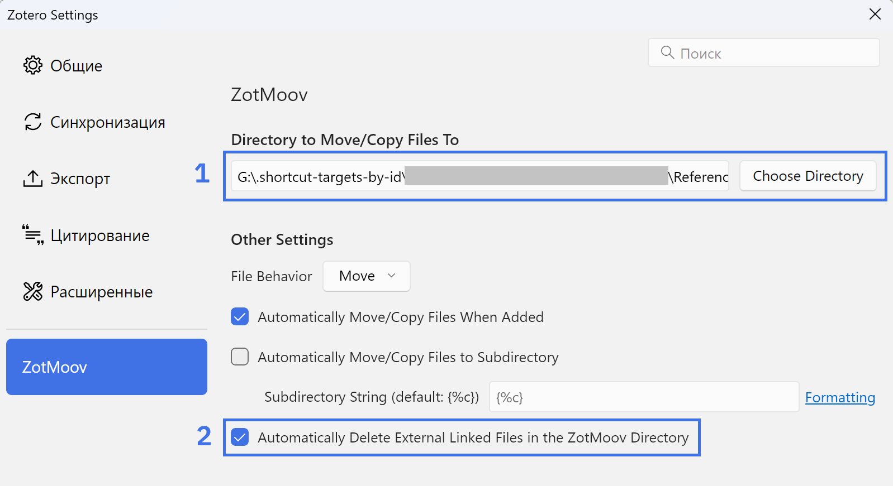{#fig-10}

## Дополнительные расширения и настройки

Скачайте и установите [стили цитирования по ГОСТ](https://bibliostyle.ru/stiles/). Рекомендуется скачивать файлы при открытом приложении Zotero, тогда они автоматически установятся программой. Иначе вы можете перейти по пути *Правка → Настройки → Цитирование*, нажать на кнопку `+` и выбрать скаченный файл стиля для установки.

Скачайте и установите расширение [Zotero Connector](https://www.zotero.org/download/) для вашего браузера. Это позволит вам быстро сохранять источники в библиотеку с метаданными и вложенными файлами непосредственно из браузера.

Скачайте и установите плагин [Translate for Zotero](https://github.com/windingwind/zotero-pdf-translate), который позволяет переводить тексты статей на разные языки. Для этого скачайте файл с расширением .xpi. Далее перейдите в Zotero в меню *Инструменты → Плагины → Шестеренка → Install Plugin From File*, далее выберите скачанный файл с расширением .xpi.

## Видео-демонстрация работы в Zotero

Ниже представлена демонстрация работы в Zotero, в том числе:

- [02:48](https://www.youtube.com/watch?v=JG7Uq_JFDzE&t=168s) Добавление ссылок в Zotero вручную
- [03:38](https://www.youtube.com/watch?v=JG7Uq_JFDzE&t=218s) Добавление ссылок с идентификатором
- [04:54](https://www.youtube.com/watch?v=JG7Uq_JFDzE&t=294s) Добавление ссылок с помощью Zotero Connector
- [05:28](https://www.youtube.com/watch?v=JG7Uq_JFDzE&t=328s) Как удалить дубликаты ссылок
- [06:01](https://www.youtube.com/watch?v=JG7Uq_JFDzE&t=361s) Как создавать коллекции
- [06:49](https://www.youtube.com/watch?v=JG7Uq_JFDzE&t=409s) Как добавлять теги
- [07:46](https://www.youtube.com/watch?v=JG7Uq_JFDzE&t=466s) Как добавить связанные ссылки
- [08:11](https://www.youtube.com/watch?v=JG7Uq_JFDzE&t=491s) Как добавлять заметки
- [08:32](https://www.youtube.com/watch?v=JG7Uq_JFDzE&t=512s) Как использовать Zotero в Microsoft Word
- [11:12](https://www.youtube.com/watch?v=JG7Uq_JFDzE&t=672s) Как добавить и редактировать стили цитирования

