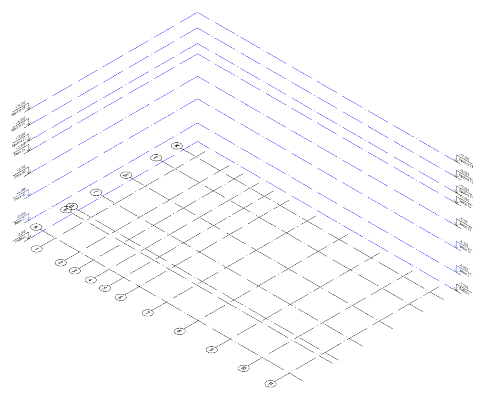
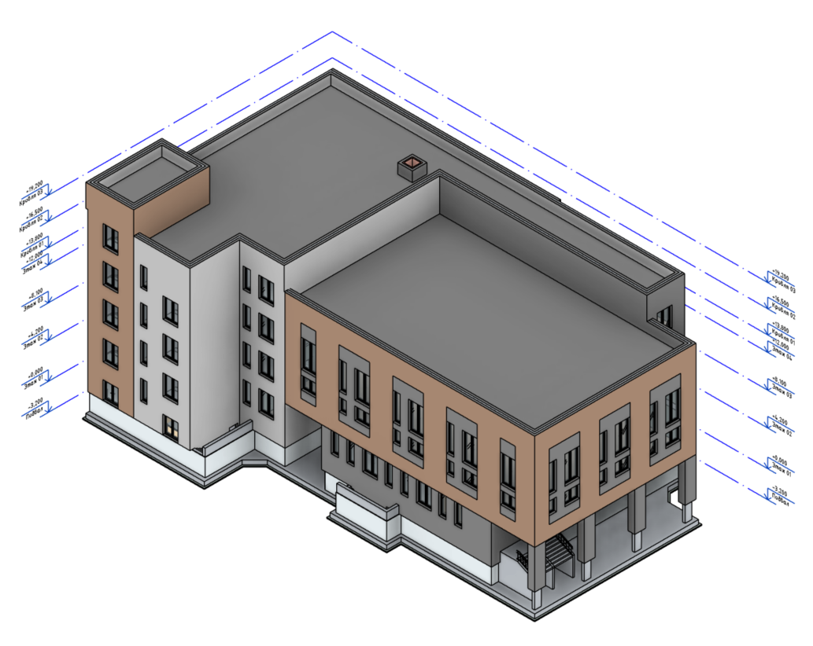
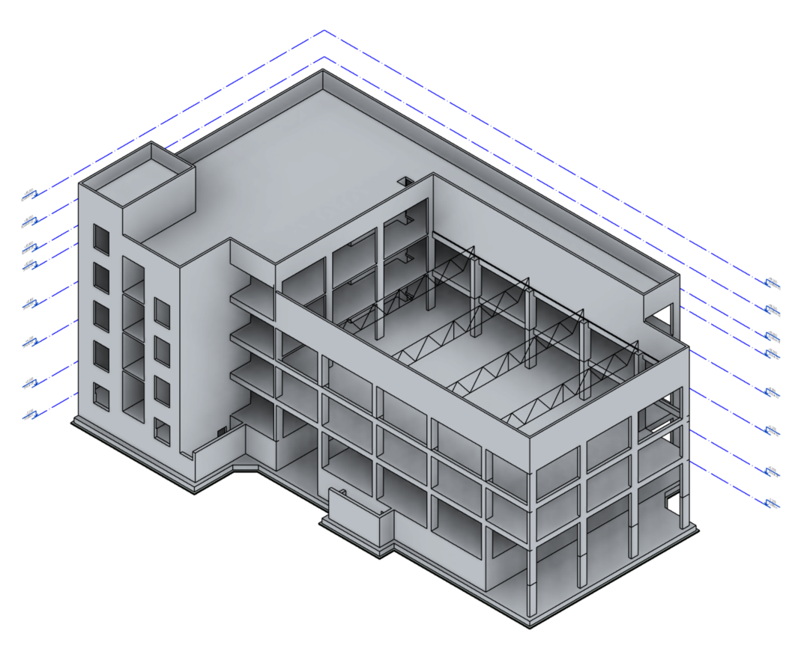

## Материалы для прохождения курса

**Файлы:**

[📂](https://drive.google.com/drive/folders/1lvqIEKKp65o3doPOLLFQmRiuYWNaf9R7?usp=sharing) DWG-подложки

[📂](https://drive.google.com/drive/folders/1urp6XP3p_rVFpvAxUZ2Guz0EVpHC-3ZF?usp=sharing) Revit-шаблоны

**Нормативные документы:**

[📄](documents\ПП_N_87_О_составе_разделов_проектной_документации_.pdf) Постановление Правительства РФ от 16 февраля 2008 г. N 87 "О составе разделов проектной документации и требованиях к их содержанию" (с изменениями и дополнениями)

[📄](documents\ГОСТ_Р_21.101-2026_Основные_требования_к_проектной_и_рабочей_документации_.pdf) Национальный стандарт РФ ГОСТ Р 21.101-2026 "Система проектной документации для строительства. Основные требования к проектной и рабочей документации"

[📄 ](documents\ГОСТ_27751-2014_Надежность_строительных_конструкций_и_оснований_.pdf) Межгосударственный стандарт ГОСТ 27751-2014 (EN 1990:2002, NEQ) (ISO 2394:1998, NEQ) 
"Надежность строительных конструкций и оснований. Основные положения"

[📄](documents\СП_20.13330.2016_с_Изм_1-6_Нагрузки_и_воздействия_.pdf) Свод правил СП 20.13330.2016 "Нагрузки и воздействия". Актуализированная редакция СНиП 2.01.07-85* (с изменениями 1-6)

[📄](documents\СП_63.13330.2018_с_Изм_1-2_Бетонные_и_железобетонные_конструкции_.pdf) Свод правил СП 63.13330.2018 "Бетонные и железобетонные конструкции. Основные положения" СНиП 52-01-2003 (с изменениями 1-2)

[📄](documents\СП_430.1325800.2018_с_Изм_1_Монолитные_конструктивные_системы_.pdf) Свод правил СП 430.1325800.2018 "Монолитные конструктивные системы. Правила проектирования" (с изменением 1)

[📄](documents\СП_468.1325800.2019_с_Изм_1_Правила_обеспечения_огнестойкости_и_огнесохранности_.pdf) Свод правил СП 468.1325800.2019 "Бетонные и железобетонные конструкции. Правила обеспечения огнестойкости и огнесохранности" (с изменением 1)

## Стадии проектирования

Проектирование объектов капитального строительства производственного и непроизводственного назначения проходит несколько стадий, каждая из которых имеет свои цели и задачи. В @tbl-stages представлены основные стадии проектирования и соответствующие им наборы комплектов чертежей.

| Укрупненные дисциплины | Предпроектная документация | Проектная документация | Рабочая документация | Документация на изделия |
|---|---|---|---|---|
| **Архитектура и генплан** | АГО[^аго]/АГР[^агр], АГК[^агк], ЭП[^эп] | ПЗ[^пз], ПЗУ[^пзу], АР[^ар] | ГП[^гп], АР[^ар] | -- |
| **Несущие конструкции** | ЭП[^эп], консультирование | КР[^кр] | КЖ[^кж], КМ[^км], КД[^кд] | КМД[^кмд], КЖИ[^кжи], НВФ[^нвф], КДД[^кдд] |
| **Инженерные системы** | ЭП[^эп], консультирование | ИОС 1-6[^иос], ТР[^тр] | ЭОМ[^эом], ВК[^вк], ОВиК[^овик], СС[^сс], ГС[^гс], ТХ[^тх] | -- |
| **Специальные разделы** | -- | ПОС[^пос], ООС[^оос], ПБ[^пб], ОДИ[^оди], ТБЭ[^тбэ], СМ[^см] и др. | АС[^ас], АИ[^аи], НВК[^нвк], ТС[^тс], ЭС[^эс], ИТП[^итп], УУТ[^уут], ОС[^ос], ПС[^пс], АК[^ак] и др. | -- |

: Стадии проектирования и соответствующие им наборы комплектов чертежей {#tbl-stages}

[^агк]: АГК -- Архитектурно-градостроительная концепция
[^аго]: АГО -- Архитектурно-градостроительный облик
[^агр]: АГР -- Архитектурно-градостроительное решение
[^аи]: АИ -- Интерьеры
[^ак]: АК -- Автоматизация комплексная
[^ар]: АР -- Объемно-планировочные и архитектурные решения
[^ас]: АС -- Архитектурно-строительные решения
[^вк]: ВК -- Внутренние системы водоснабжения и канализации
[^гп]: ГП -- Генеральный план
[^гс]: ГС -- Газоснабжение (внутренние устройства)
[^иос]: ИОС -- Сведения об инженерном оборудовании, о сетях и системах инженерно-технического обеспечения:
а) подраздел "Система электроснабжения";
б) подраздел "Система водоснабжения";
в) подраздел "Система водоотведения";
г) подраздел "Отопление, вентиляция и кондиционирование воздуха, тепловые сети";
д) подраздел "Сети связи";
е) подраздел "Система газоснабжения";
[^итп]: ИТП -- Индивидуальный тепловой пункт
[^кд]: КД -- Конструкции деревянные
[^кдд]: КДД -- Конструкции деревянные, деталировочные чертежи
[^кж]: КЖ -- Конструкции железобетонные
[^кжи]: КЖИ -- Конструкции железобетонные, изделия
[^км]: КМ -- Конструкции металлические
[^кмд]: КМД -- Конструкции металлические, деталировочные чертежи
[^кр]: КР -- Конструктивные решения
[^нвк]: НВК -- Наружные сети водоснабжения и канализации
[^нвф]: НВФ -- Навесные вентилируемые фасады
[^овик]: ОВиК -- Отопление, вентиляция и кондиционирование воздуха
[^оди]: ОДИ -- Мероприятия по обеспечению доступа инвалидов
[^оос]: ООС -- Мероприятия по охране окружающей среды
[^ос]: ОС -- Охранная и охранно-пожарная сигнализация
[^пб]: ПБ -- Мероприятия по обеспечению пожарной безопасности
[^пз]: ПЗ -- Пояснительная записка
[^пзу]: ПЗУ -- Схема планировочной организации земельного участка
[^пос]: ПОС -- Проект организации строительства
[^пс]: ПС -- Пожарная сигнализация
[^см]: СМ -- Смета на строительство, реконструкцию, капитальный ремонт, снос объекта капитального строительства
[^сс]: СС -- Сети связи (слаботочные системы)
[^тбэ]: ТБЭ -- Требования к обеспечению безопасной эксплуатации объекта капитального строительства
[^тр]: ТР -- Технологические решения
[^тс]: ТС -- Тепломеханические решения тепловых сетей
[^тх]: ТХ -- Технология производства
[^уут]: УУТ -- Узел учёта тепловой энергии
[^эом]: ЭОМ -- Электрооборудование и электрическое освещение
[^эп]: ЭП -- Эскизный проект
[^эс]: ЭС -- Электроснабжение

### Предпроектная документация

Разработка предпроектной документации слабо регламентирована, поэтому в ней могут быть представлены различные варианты комплектов чертежей, в частности, в нее могут входить:

- *архитектурно-градостроительный облик* (*АГО*) или *архитектурно-градостроительное решение* (*АГР*) -- регламентируются региональными нормативными документами;

- *архитектурно-градостроительная концепция* (*АГК*) и *эскизный проект* (*ЭП*) -- инициативные документы для презентации инвесторам, расчета технико-экономических показателей.

::: {.callout}
*Эскизные проекты несущих конструкций и инженерных систем* разрабатываются отдельно или в составе вышеописанных комплектов, при этом профильные специалисты проводят консультационное сопровождение.
:::

### Проектная документация

Разработка проектной документации регламентируется Постановлением Правительства РФ № 87 [📄](documents\ПП_N_87_О_составе_разделов_проектной_документации_.pdf) (в части состава) и ГОСТ Р 21.101-2026 [📄](documents\ГОСТ_Р_21.101-2026_Основные_требования_к_проектной_и_рабочей_документации_.pdf) (в части оформления).

В состав проектной документации для строительства объектов капитального строительства производственного и непроизводственного назначения входят:

а) *раздел 1 "Пояснительная записка"* (*ПЗ*);

б) *раздел 2 "Схема планировочной организации земельного участка"* (*ПЗУ*);

в) *раздел 3 "Объемно-планировочные и архитектурные решения"* (*АР*);

г) *раздел 4 "Конструктивные решения"* (*КР*);

д) *раздел 5 "Сведения об инженерном оборудовании, о сетях и системах инженерно-технического обеспечения"* (*ИОС*);

е) *раздел 6 "Технологические решения"* (*ТР*) (для объектов капитального строительства непроизводственного назначения разрабатывается в случае наличия требования о его разработке в задании на проектирование);

ж) *раздел 7 "Проект организации строительства"* (*ПОС*), содержащий в том числе проект организации работ по сносу объектов капитального строительства, их частей (при необходимости сноса объектов капитального строительства, их частей для строительства, реконструкции других объектов капитального строительства);

з) *раздел 8 "Мероприятия по охране окружающей среды"* (*ООС*);

и) *раздел 9 "Мероприятия по обеспечению пожарной безопасности"* (*ПБ*);

к) *раздел 10 "Требования к обеспечению безопасной эксплуатации объектов капитального строительства"* (*ТБЭ*);

л) *раздел 11 "Мероприятия по обеспечению доступа инвалидов к объекту капитального строительства"* (*ОДИ*);

м) *раздел 12 "Смета на строительство, реконструкцию, капитальный ремонт, снос объекта капитального строительства"* (*СМ*);

н) *раздел 13 "Иная документация в случаях, предусмотренных законодательными и иными нормативными правовыми актами Российской Федерации"*.

**Согласно п. 14 Раздел 4 "Конструктивные решения" содержит:**

**в текстовой части:**

а) сведения о топографических, инженерно-геологических, гидрогеологических, метеорологических и климатических условиях земельного участка, предоставленного для размещения объекта капитального строительства;

б) сведения об особых природных климатических условиях территории, на которой располагается земельный участок, предоставленный для размещения объекта капитального строительства;

в) сведения о прочностных и деформационных характеристиках грунта в основании объекта капитального строительства;

г) уровень грунтовых вод, их химический состав, агрессивность грунтовых вод и грунта по отношению к материалам, используемым при строительстве, реконструкции, капитальном ремонте подземной части объекта капитального строительства;

д) описание и обоснование конструктивных решений зданий и сооружений, включая их пространственные схемы, принятые при выполнении расчетов строительных конструкций;

е) описание и обоснование технических решений, обеспечивающих необходимую прочность, устойчивость, пространственную неизменяемость зданий и сооружений объекта капитального строительства в целом, а также их отдельных конструктивных элементов, узлов, деталей в процессе изготовления, перевозки, строительства, реконструкции, капитального ремонта и эксплуатации объекта капитального строительства;

ж) описание конструктивных и технических решений подземной части объекта капитального строительства;

з-к) утратили силу с 1 сентября 2022 г.

л) обоснование проектных решений и мероприятий, обеспечивающих:

- соблюдение требуемых теплозащитных характеристик ограждающих конструкций;
- снижение шума и вибраций;
- гидроизоляцию и пароизоляцию помещений;
- снижение загазованности помещений;
- удаление избытков тепла;
- соблюдение безопасного уровня электромагнитных и иных излучений;
- пожарную безопасность;
- соответствие зданий, строений и сооружений требованиям энергетической эффективности и требованиям оснащенности их приборами учета используемых энергетических ресурсов (за исключением зданий, строений, сооружений, на которые требования энергетической эффективности и требования оснащенности их приборами учета используемых энергетических ресурсов не распространяются);

м) характеристику и обоснование конструкций полов, кровли, потолков, перегородок;

н) перечень мероприятий по защите строительных конструкций и фундаментов от разрушения;

о) описание инженерных решений и сооружений, обеспечивающих защиту территории объекта капитального строительства, отдельных зданий и сооружений объекта капитального строительства, а также персонала (жителей) от опасных природных и техногенных процессов;

о^1^) перечень мероприятий по обеспечению соблюдения установленных требований энергетической эффективности к конструктивным решениям, влияющим на энергетическую эффективность зданий, строений и сооружений;

о^2^) описание и обоснование принятых конструктивных, функционально-технологических и инженерно-технических решений, направленных на повышение энергетической эффективности объекта капитального строительства, в том числе в отношении наружных и внутренних систем электроснабжения, отопления, вентиляции, кондиционирования воздуха помещений (включая обоснование оптимальности размещения отопительного оборудования, решений в отношении тепловой изоляции теплопроводов, характеристик материалов для изготовления воздуховодов), горячего водоснабжения, оборотного водоснабжения и повторного использования тепла подогретой воды;

**в графической части:**

п) поэтажные планы зданий и сооружений с указанием размеров и экспликации помещений;

р) чертежи разрезов зданий, строений и сооружений с изображением несущих и ограждающих конструкций, указанием размерной привязки осей или поверхностей элементов конструкций к координационным осям здания (строения, сооружения) или в необходимых случаях к другим элементам конструкций, отметок наиболее характерных уровней элементов конструкций, позиций (марок) элементов конструкций, а также с изображением линий геологических разрезов, разграничивающих слои грунта с различными геологическими характеристиками, для фундаментов и свайных оснований;

с) чертежи фрагментов планов и разрезов, требующих детального изображения;

т) схемы каркасов и узлов строительных конструкций;

у) планы перекрытий, покрытий, кровли;

ф) схемы расположения ограждающих конструкций и перегородок;

х) план и сечения фундаментов.
:::

::: {.callout}
Помимо текстовой части, как правило, отдельно оформляется расчетно-пояснительная записка (РПЗ), в которой приводятся обоснования выполненных расчетов несущих конструкций.
:::

### Рабочая документация

Разработка **рабочей документации** регламентируется ГОСТ Р 21.101-2026 [📄](documents\ГОСТ_Р_21.101-2026_Основные_требования_к_проектной_и_рабочей_документации_.pdf) (в части оформления).

## Информационная модель объекта капитального строительства

На практике информационная модель объекта капитального строительства не ведётся внутри одного файла. Разбиение выполняется так, чтобы одна модель соответствовала одному блоку/секции. Далее модель дробится по разделам: АР, КР, ОВ, ВК и другим.

::: column-margin





:::

Чтобы все дисциплинарные модели совпадали в пространстве без ручной подгонки, используется связка «базовый файл → разбивочный файл → дисциплинарные модели»:

- **Базовый файл** хранит систему координат и высот объекта.
- **Разбивочный файл** (один на блок/секцию) получает координаты от базового и формирует единую сетку осей и уровней.
- **Дисциплинарные модели** (АР, КР, ОВ, ВК и т.д.) подключаются к разбивочному файлу как связанные модели и наследуют из него оси и уровни.

```{mermaid}
flowchart TD
    B[Базовый]
    R1[Разбивочный 1]
    R2[...]

    B -->|координаты| R1
    B -->|координаты| R2

    R1 -->|оси и уровни| AR[АР]
    R1 -->|оси и уровни| KR[КР]
    R1 -->|оси и уровни| OV[ОВ]
    R1 -->|оси и уровни| VK[ВК]
    R1 -->|оси и уровни| D[...]
```

## Особенности разработки моделей КР и КЖ с учётом стадийности проектирования

В разработке.
