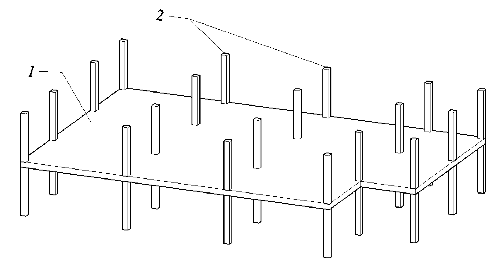
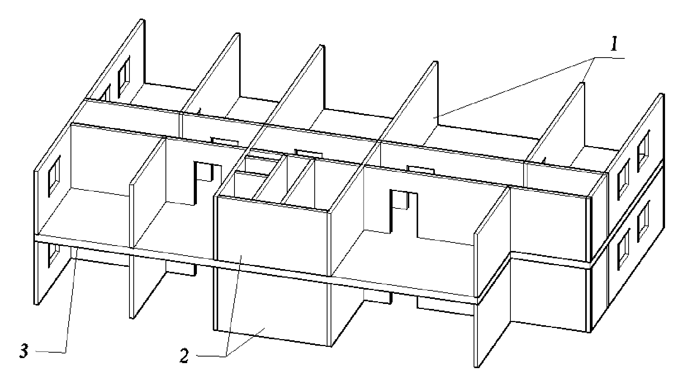
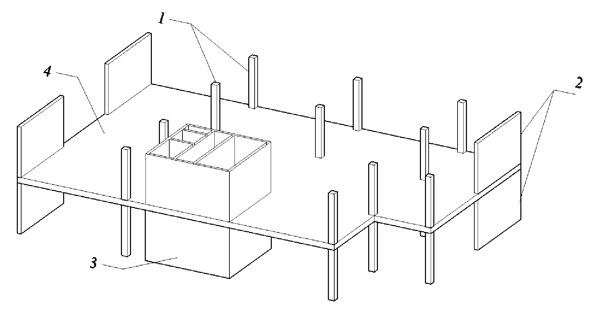
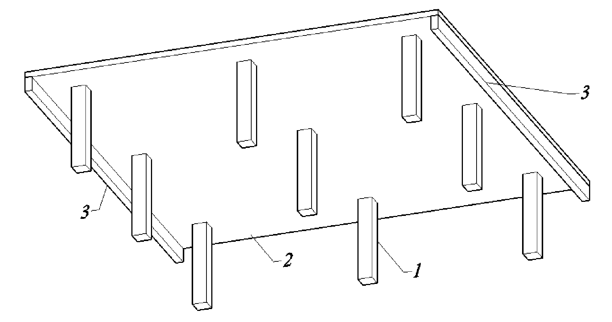
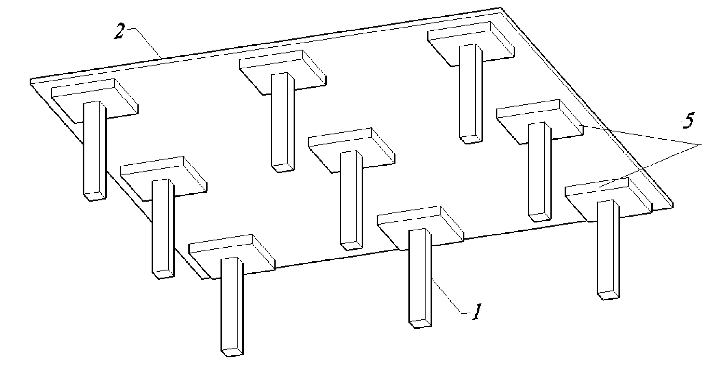
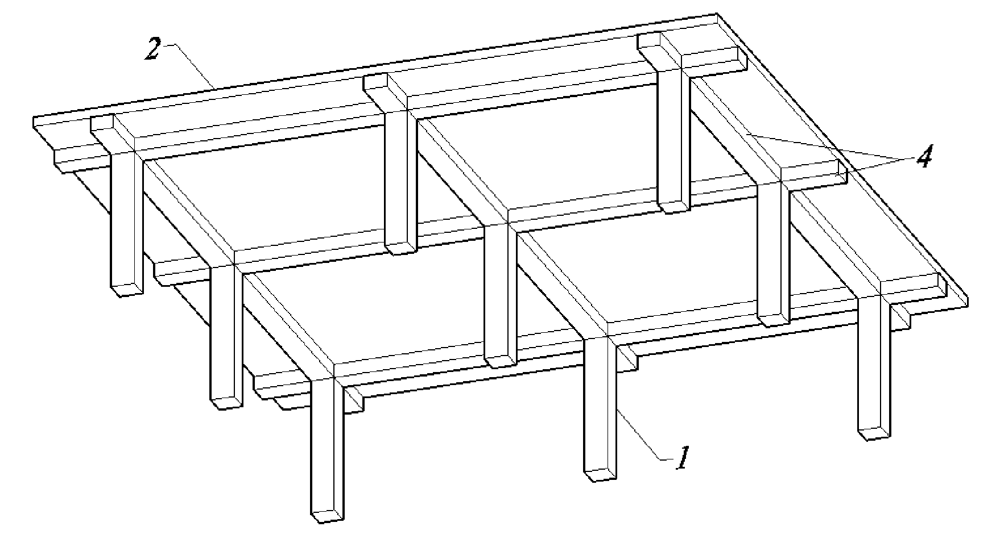
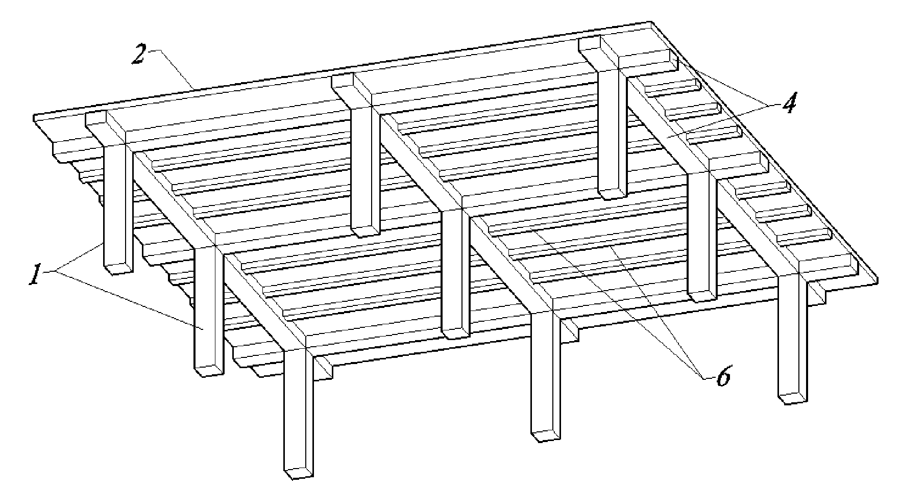
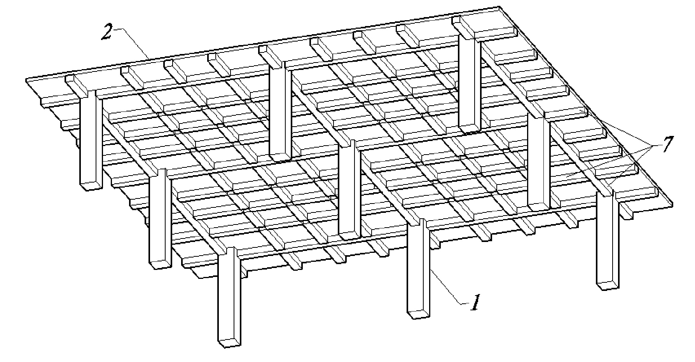

::: column-margin
[← К списку уроков](index.qmd)

[⇲ Скачать материалы курса](https://drive.google.com/drive/folders/1dlvQ6eQCNpVPVrjqIdcA2aRlp87ZvI75?usp=drive_link)

---

Другие полезные ссылки:

[🌏︎ Источник Revit-шаблонов](https://bim2b.ru/)
:::

```{=html}
<div style="position: relative; width: 100%; padding-top: 56.25%; margin: 1em 0;">
  <iframe 
    src="https://vkvideo.ru/video_ext.php?oid=-241507062&id=456239017&hash=1ecf1c2062ba0516&hd=3"
    style="position: absolute; top: 0; left: 0; width: 100%; height: 100%; background-color: #000;"
    frameborder="0"
    allow="autoplay; encrypted-media; fullscreen; picture-in-picture; screen-wake-lock;"
    allowfullscreen>
  </iframe>
</div>
```

## План занятия

[0:00:00](https://vkvideo.ru/video-241507062_456239017?t=0h0m0s) – Структура файлов информационной модели здания\
[0:01:36](https://vkvideo.ru/video-241507062_456239017?t=0h1m36s) – Обзор проектируемого объекта\
[0:03:05](https://vkvideo.ru/video-241507062_456239017?t=0h3m5s) – Структура папок\
[0:05:18](https://vkvideo.ru/video-241507062_456239017?t=0h5m18s) – Создание разбивочного файла\
[0:10:35](https://vkvideo.ru/video-241507062_456239017?t=0h10m35s) – Моделирование уровней\
[0:13:33](https://vkvideo.ru/video-241507062_456239017?t=0h13m33s) – Моделирование осей\
[0:29:21](https://vkvideo.ru/video-241507062_456239017?t=0h29m21s) – Создание файла раздела КР, импорт связанного файла\
[0:34:09](https://vkvideo.ru/video-241507062_456239017?t=0h34m9s) – Копирование и мониторинг осей и уровней\
[0:42:40](https://vkvideo.ru/video-241507062_456239017?t=0h42m40s) – Создание планов несущих конструкций\
[0:45:30](https://vkvideo.ru/video-241507062_456239017?t=0h45m30s) – Моделирование фундаментной плиты\
[0:55:31](https://vkvideo.ru/video-241507062_456239017?t=0h55m31s) – Моделирование плит перекрытий\
[1:14:40](https://vkvideo.ru/video-241507062_456239017?t=1h14m40s) – Моделирование плит покрытия\
[1:23:05](https://vkvideo.ru/video-241507062_456239017?t=1h23m5s) – Моделирование отверстий

## Теоретический блок

### Структура файлов

Скачайте [⇲&nbsp;материалы курса](https://drive.google.com/drive/folders/1dlvQ6eQCNpVPVrjqIdcA2aRlp87ZvI75?usp=drive_link) и разместите их внутри своей папки. Создайте внутри структуру папок согласно следующей схеме:

```
Группа_ФамилияИО/
├── Литература/
├── Проект/
│   ├── 01_Входящее/
│   ├── 02_Разработка/
│   │   ├── 00_Base/
│   │   ├── 01_AxesAndLevels/
│   │   │   └── School-9_AxesAndLevels_RVT2019.rvt
│   │   ├── AR/
│   │   └── KR/
│   │       └── School-9_KR_RVT2019.rvt
│   └── 03_Исходящее/
└── РевитШаблоны/
    ├── ADSK_RU_ШаблонПроекта_АР_r2019_v1.2.1.rte
    └── ADSK_RU_ШаблонПроекта_КЖ_r2019_v1.2.1.rte
```

### Конструктивные системы

::: column-margin





:::

Конструктивные системы монолитных железобетонных зданий и сооружений описаны в разделе 5.1  [⇲&nbsp;СП&nbsp;430.1325800.2018](documents/СП_430.1325800.2018_с_Изм_1_Монолитные_конструктивные_системы_.pdf).

В зависимости от типа вертикальных несущих элементов (колонн, пилонов и стен) различают следующие **монолитные конструктивные системы**:

- Каркасная -- колонны или пилоны
- Стеновая -- стены
- Каркасно-стеновая (смешанная) -- колонны, пилоны и стены
- Комбинированная -- несколько конструктивных систем в здании

По способу **сопротивления горизонтальным нагрузкам** различают схемы:

- Связевая -- работа вертикальных несущих элементов (стен, ядер жесткости) как консолей, защемленных в фундаменте
- Рамная -- работа рам, образуемых колоннами, пилонами и ригелями (условными ригелями), с жесткими узлами сопряжения
- Рамно-связевая -- совместная работа связей (стен, ядер жесткости) и рам, образуемых колоннами и ригелями (условными ригелями), с жесткими узлами сопряжения

### Типы и основные конструктивные параметры плоских фундаментных плит

Типы фундаментов из монолитного железобетона описаны в п. 5.1.7 [⇲&nbsp;СП&nbsp;430.1325800.2018](documents/СП_430.1325800.2018_с_Изм_1_Монолитные_конструктивные_системы_.pdf).

Для зданий (сооружений) применяют различные **типы фундаментов из монолитного железобетона**:

- отдельные (столбчатые)
- ленточные
- плитные
- свайные
- свайно-плитные (комбинированные)
- ребристые
- коробчатые и пр.

Основные конструктивные параметры плоских фундаментных плит описаны в п. 5.2.7 [⇲&nbsp;СП&nbsp;430.1325800.2018](documents/СП_430.1325800.2018_с_Изм_1_Монолитные_конструктивные_системы_.pdf).

| Толщина | Класс по прочности | Продольное армирование | Марка по водонепроницаемости
| ---------|-------------------|------------------------|-----------------------------
| 0,5 м ≤ t ≤ 3,0 м | не менее В20 | не менее 0,3% | не менее W6

В первом приближении допускается толщину плоской фундаментной плиты на естественном основании назначать равной 1/65 ÷ 1/50 *h*<sub>зд</sub>, где *h*<sub>зд</sub> -- строительная высота здания (сооружения), равная расстоянию от верха фундамента до срединной плоскости плиты покрытия.

### Типы и основные конструктивные параметры плит перекрытий

::: column-margin









:::

Типы плит перекрытий из монолитного железобетона описаны в п. 5.1.10 [⇲&nbsp;СП&nbsp;430.1325800.2018](documents/СП_430.1325800.2018_с_Изм_1_Монолитные_конструктивные_системы_.pdf)

К плитам относят элементы, с соотношениями размеров *а* > 5*t*, (*а* -- наименьший размер рядовой ячейки плиты в плане, *t* -- толщина плиты). К балкам относят элементы, с соотношением размеров *l* > 3*h* (*l* -- размер пролета балки, *h* -- высота элемента. В противном случае такие балки относят к балкам-стенкам (или к высоким балкам).

Конструкцию **безбалочных перекрытий** принимают в виде:

-  плит плоских (в том числе с контурными балками по свободным краям перекрытия)
- плит с капителями

Конструкцию **балочных перекрытий** принимают в виде:

- плит с балками (в одном или нескольких перекрестных направлениях)
- плит ребристых (с главными и второстепенными балками)
- плит кессонных

Ширину балок принимают преимущественно не более габаритного размера колонны и пилона, высоту балок -- не менее толщины плитной части перекрытий.

Допускается для размещения инженерных сетей и звукоизоляции, устройства гладких потолков
и т.п. принимать размещение балок в перекрытиях ребрами вверх. Конструкции балочных перекрытий с частым шагом балок (кессонные) следует применять преимущественно в регулярных конструктивных системах.

Основные конструктивные параметры плит перекрытий описаны в п. 5.2.14 [⇲&nbsp;СП&nbsp;430.1325800.2018](documents/СП_430.1325800.2018_с_Изм_1_Монолитные_конструктивные_системы_.pdf).

| Тип плиты | Толщина | Класс по прочности
| --------- | ---------|-------------------
| Плоская | 160 мм ≤ t | не менее В20
| Ребристая и кесонная | 250 мм ≤ t ≤ 500 мм | не менее В25

В первом приближении толщину плоских плит перекрытия в каркасных и смешанных
[конструктивных системах](#конструктивные-системы) рекомендуется назначать не менее *l*/30, в стеновых конструктивных системах - не менее *l*/35, где *l* -- длина наибольшего пролета плиты.

## Вопросы для самоконтроля

1.  Создана структура папок проекта?
2.  Создан разбивочный файл School-9_AxesAndLevels_RVT2019 с уровнями и осями?
3.  Создан файл раздела КР School-9_KR_RVT2019?
4.  Уровни и оси скопированы и мониторятся из разбивочного файла?
5.  Смоделированы фундаментная плита и плиты перекрытия и покрытия?
6.  Есть понимание, как назначать толщину плит согласно рекомендациям СП 430.1325800.2018?