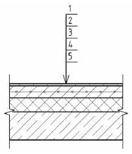
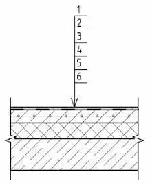

::: column-margin
[← К списку уроков](index.qmd)

[⇲ Скачать материалы курса](https://drive.google.com/drive/folders/1dlvQ6eQCNpVPVrjqIdcA2aRlp87ZvI75?usp=drive_link)
:::

## План занятия

В разработке.

## Исходные данные

Сбор снеговой и ветровой нагрузки осуществлять для района строительства, приведенного справа. Вариант задания определяется по номеру в списке группы.

::: {.callout collapse="true"}

## Районы строительства по вариантам

| Номер варианта | Район строительства |
|----------------|---------------------|
| 1              | Астрахань |
| 2              | Белгород |
| 3              | Благовещенск |
| 4              | Великий Новгород |
| 5              | Волгоград |
| 6              | Воронеж |
| 7              | Ижевск |
| 8              | Казань |
| 9              | Калуга |
| 10             | Кемерово |
| 11             | Красноярск |
| 12             | Липецк |
| 13             | Нижний Новгород |
| 14             | Новосибирск |
| 15             | Омск |
| 16             | Оренбург |
| 17             | Пенза |
| 18             | Пермь |
| 19             | Псков |
| 20             | Рязань |
| 21             | Саратов |
| 22             | Тамбов |
| 23             | Томск |
| 24             | Тюмень |
| 25             | Ульяновск |
:::

Конструкции полов описаны ниже:

| Тип | Схема пола | Состав пола
| --- | ----------- | -----------
| 1 |  | (1) керамогранитная плитка с нескользящей поверхностью на клею -- 15мм; (2) полусухая стяжка М200, армированная в верхней зоне сеткой из арматуры ⌀4Вр1 100х100мм -- 85мм; (3) пленка полиэтиленовая - 1 слой; (4) утеплитель -- плиты минераловатные Изорок Изофлор (Y=110 кг/м3) или аналог -- 100мм; (5) монолитное ж.б. перекрытие
| 2 |  | (1) керамогранитная плитка с нескользящей поверхностью на клею -- 15мм; (2) гидроизоляция -- рулонный безосновный самоклеящийся битумно-полимерный гидроизоляционный материал Техноэласт Барьер Лайт по праймеру битумному эмульсионному ТехноНиколь №04 -- 1 слой (2мм); (3) полусухая стяжка М200, армированная в верхней зоне сеткой из арматуры ⌀4Вр1 100х100мм -- 83мм; (4) пленка полиэтиленовая - 1 слой; (5) утеплитель -- плиты минераловатные Изорок Изофлор (Y=110 кг/м3) или аналог -- 100мм; (6) монолитное ж.б. перекрытие

