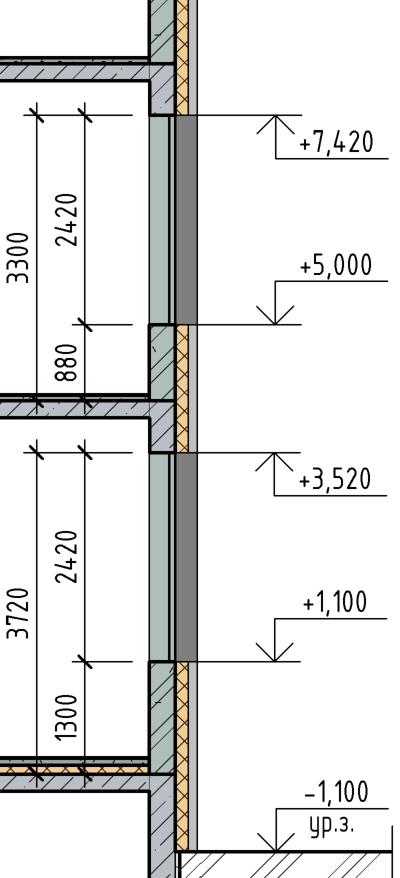
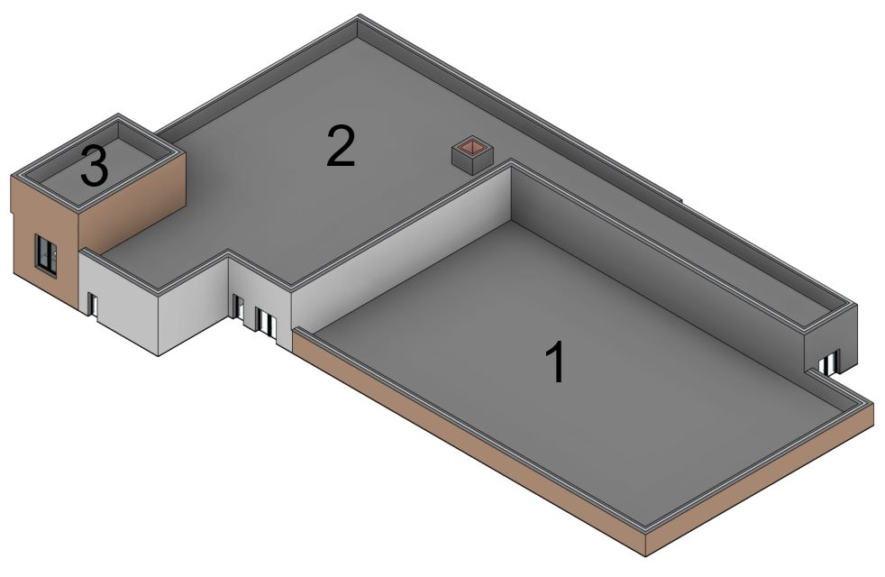
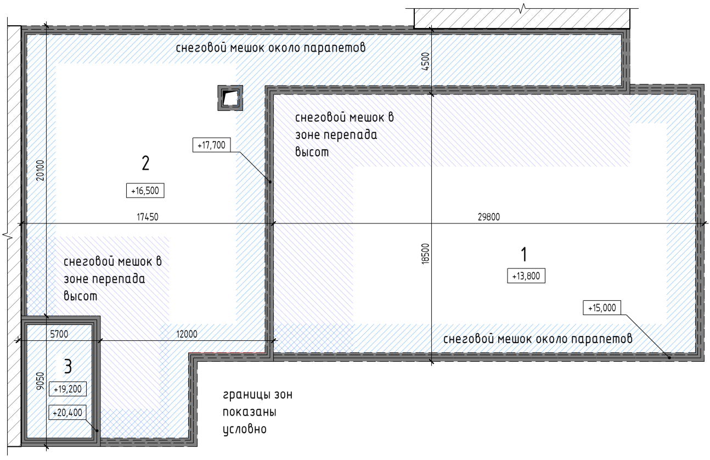
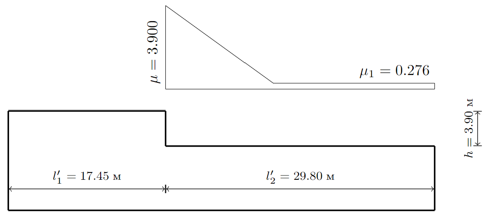
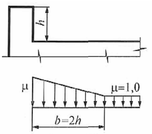

::: column-margin
[← К списку уроков](index.qmd)

[⇲ Скачать материалы курса](https://drive.google.com/drive/folders/1dlvQ6eQCNpVPVrjqIdcA2aRlp87ZvI75?usp=drive_link)

---

Другие полезные ссылки:

[🌏︎ Онлайн-калькулятор Webcad](http://webcad.pro/rasch.html)
:::

## План занятия

В разработке.

## Исходные данные

Сбор снеговой и ветровой нагрузки осуществлять для района строительства согласно варианту. Вариант соответствует порядковому номеру в списке группы.

| Номер варианта | Район строительства | Номер варианта | Район строительства | Номер варианта | Район строительства |
| :------------: | :------------------ | :------------: | :------------------ | :------------: | :------------------ |
|       1        | Астрахань           |       9        | Калуга              |       17       | Пенза               |
|       2        | Белгород            |       10       | Кемерово            |       18       | Пермь               |
|       3        | Благовещенск        |       11       | Красноярск          |       19       | Псков               |
|       4        | Великий Новгород    |       12       | Липецк              |       20       | Рязань              |
|       5        | Волгоград           |       13       | Нижний Новгород     |       21       | Саратов             |
|       6        | Воронеж             |       14       | Новосибирск         |       22       | Тамбов              |
|       7        | Ижевск              |       15       | Омск                |       23       | Томск               |
|       8        | Казань              |       16       | Оренбург            |       24       | Тюмень              |

: Районы строительства по вариантам

## Теоретический блок

### Классификация нагрузок

Классификация нагрузок изложена в разделе 5 [⇲ СП 20.13330.2016](documents/СП_20.13330.2016_с_Изм_1-6_Нагрузки_и_воздействия_.pdf)

```{mermaid}
flowchart TD
    T[Нагрузки]

    T --> L1[Постоянные]
    T --> L2[Временные]
    T --> L3[Особые]

    L2 --> L21[Кратковременные]
    L2 --> L22[Длительные]
```

### Вес строительных конструкций

Вес постоянных строительных конструкций относится к постоянным нагрузкам. Коэффициенты надежности по нагрузке $\gamma_f$ для веса строительных конструкций и грунтов приведены в таблице 7.1 [⇲ СП 20](documents/СП_20.13330.2016_с_Изм_1-6_Нагрузки_и_воздействия_.pdf).

Вес несущих конструкций (заданных в расчетной конечно-элементной модели) учитывается автоматически в программном комплексе.

Вес прочих строительных конструкций рассчитывается на основании данных о составах полов, кровли, ограждающих конструкций.

Нагрузки от веса полов и кровли рассчитываются как равномерно распределенные по площади. В запас при переходе из $кг$ в $Н$ можно использовать значение ускорения свободного падения $g=10 м/c^2$.

:::{.column-page-right}
| Наименование                   | Плотность, кг/м^3^ | Толщина, мм | Норм. значение, кН/м^2^ | $\gamma_f (1/\gamma_f)$ | Расч. значение, кН/м^2^ |
| :----------------------------- | :----------------- | :---------- | :---------------------- | :---------------------- | :---------------------- |
| Плитка керамогранитная на клею | 2400               | 15          | 0,36                    | 1,2                     | 0,43                    |
| Стяжка армированная            | 1800               | 85          | 1,53                    | 1,3                     | 1,99                    |
| Пленка полиэтиленовая[^1]      |                    |             | 0,01                    | 1,2                     | 0,01                    |
| Плиты минераловатные           | 110                | 100         | 0,01                    | 1,2                     | 0,01                    |
| **Итого тип пола {1}:**        |                    | 200         | 1,91                    | 1,28(0,781)             | 2,45                    |
| Плитка керамогранитная на клею | 2400               | 15          | 0,36                    | 1,2                     | 0,43                    |
| Рулонная гидроизоляция         |                    |             | 0,02                    | 1,2                     | 0,02                    |
| Стяжка армированная            | 1800               | 85          | 1,53                    | 1,3                     | 1,99                    |
| Пленка полиэтиленовая          |                    |             | 0,01                    | 1,2                     | 0,01                    |
| Плиты минераловатные           | 110                | 100         | 0,01                    | 1,2                     | 0,01                    |
| **Итого тип пола {2}:**        |                    | 200         | 1,93                    | 1,28(0,782)             | 2,47                    |

: Пример сбора нагрузки от веса конструкции полов

[^1]: Для тонких и/или рулонных материалов, для которых указана масса 1 м^2^ слоя, сразу указывается нормативное значение.
:::

Нагрузки от веса перегородок и фасадных стен рассчитываются как равномерно распределенные по длине. Для этого можно произвести расчет удельного веса на 1 м^2^ площади, а затем выполнить расчет с учетом фактической высоты перегородок на этажах. При этом расчет веса внутренних перегородок в запас выполняется, как правило, без учета наличия дверных проемов.

:::{.column-page-right}
| Наименование                        | Плотность, кг/м^3^ | Толщина, мм | Норм. значение, кН/м^2^ | $\gamma_f (1/\gamma_f)$ | Расч. значение, кН/м^2^ |
| :---------------------------------- | :----------------- | :---------- | :---------------------- | :---------------------- | :---------------------- |
| Газобетонные блоки                  | 600                | 200         | 1,20                    | 1,2                     | 1,44                    |
| Штукатурка, 2 стороны               | 1800               | 40          | 0,72                    | 1,3                     | 0,94                    |
| **Итого перегородки из газоблока:** |                    | 240         | 1,92                    | 1,24(0,808)             | 2,38                    |
| Обшивка из ГСП 2x12,5               | 1250               | 25          | 0,31                    | 1,2                     | 0,38                    |
| Несущая подсистема                  |                    | 75          | 0,05                    | 1,2                     | 0,06                    |
| Минераловатная звукоизоляция        | 50                 | 50          | 0,03                    | 1,2                     | 0,03                    |
| Обшивка из ГСП 2x12,5               | 1250               | 25          | 0,31                    | 1,2                     | 0,38                    |
| **Итого перегородки из ГСП:**       |                    | 125         | 0,34                    | 1,20(0,833)             | 0,41                    |

: Пример сбора нагрузки от веса конструкции перегородок на 1 м^2^ площади

| Наименование                        | Этаж | Высота, мм | Норм. значение, кН/м | $\gamma_f (1/\gamma_f)$ | Норм. значение, кН/м |
| :---------------------------------- | :--- | :--------- | :------------------- | :---------------------- | :------------------- |
| **Итого перегородки из газоблока:** | 1    | 4120       | 7,91                 | 1,24(0,808)             | 9,79                 |
|                                     | 2-4  | 3700       | 7,10                 | 1,24(0,808)             | 8,79                 |
| **Итого перегородки из ГСП:**       | 1    | 4120       | 1,39                 | 1,20(0,833)             | 1,67                 |
|                                     | 2-4  | 3700       | 1,25                 | 1,20(0,833)             | 1,50                 |

: Пример сбора нагрузки от веса конструкции перегородок на 1 м длины
:::

Нагрузки от веса наружных стен рассчитываются с учетом фактического расположения и геометрии оконных проемов. При этом нагрузки на уровне перекрытий либо сводятся к эквивалентным равномерно распределенным по длине (с учетом наличия проемов и веса окон) или задаются участками с соответствующими значениями нагрузки под глухими участками стен и участками с оконными проемами.

:::{.column-page-right}
| Наименование                               | Плотность, кг/м^3^ | Толщина, мм | Норм. значение, кН/м^2^ | $\gamma_f (1/\gamma_f)$ | Расч. значение, кН/м^2^ |
| :----------------------------------------- | :----------------- | :---------- | :---------------------- | :---------------------- | :---------------------- |
| Штукатурный слой                           | 1800               | 20          | 0,36                    | 1,2                     | 0,43                    |
| Ячеистобетонный блок                       | 600                | 300         | 1,80                    | 1,3                     | 2,34                    |
| Минераловатный плиты                       | 90                 | 150         | 0,14                    | 1,2                     | 0,16                    |
| Ветровлагозащитная мембрана                |                    |             | 0,02                    | 1,2                     | 0,02                    |
| Металлическая подсистема                   |                    |             | 0,05                    | 1,2                     | 0,06                    |
| Плитка керамогранитная                     | 15                 | 2400        | 0,36                    | 1,2                     | 0,43                    |
| **Итого глухая часть наружных стен:**      |                    | 2870        | 2,73                    | 1,27(0,790)             | 3,45                    |
| Стеклопакет (3*4мм)                        | 2500               | 12          | 0,30                    | 1,2                     | 0,36                    |
| Рама                                       |                    |             | 0,075                   | 1,2                     | 0,09                    |
| **Итого остекленная часть наружных стен:** | 2500               |             | 0,38                    | 1,20(0,833)             | 0,45                    |

: Пример сбора нагрузки от веса конструкции наружных стен на 1 м^2^ площади
:::

::: {.column-margin}

:::

| Наименование                               | Этаж | Высота, мм | Норм. значение, кН/м | $\gamma_f (1/\gamma_f)$ | Норм. значение, кН/м |
| :----------------------------------------- | :--- | :--------- | :------------------- | :---------------------- | :------------------- |
| Глухая часть                               | 1    | 1300       | 3,54                 | 1,27                    | 4,49                 |
| Остекленная часть                          | 1    | 2420       | 0,91                 | 1,20                    | 1,09                 |
| **Итого остекленная часть наружных стен:** | 1    | 3720       | 4,45                 | 1,25(0,798)             | 5,57                 |
| **Итого глухая часть наружных стен:**      | 1    | 3720       | 10,14                | 1,27(0,790)             | 12,83                |
| Глухая часть                               | 2-4  | 880        | 2,40                 | 1,27                    | 3,04                 |
| Остекленная часть                          | 2-4  | 2420       | 0,91                 | 1,20                    | 1,09                 |
| **Итого остекленная часть наружных стен:** | 2-4  | 3300       | 3,31                 | 1,25(0,801)             | 4,13                 |
| **Итого глухая часть наружных стен:**      | 2-4  | 3300       | 8,99                 | 1,27(0,790)             | 11,39                |

: Пример сбора нагрузки от веса конструкции наружных стен на 1 м длины

### «Полезные» равномерно распределенные нагрузки

Нормативные значения равномерно распределенных кратковременных нагрузок на плиты перекрытий, лестницы и полы на грунтах приведены в табл. 8.3 [⇲ СП 20](documents/СП_20.13330.2016_с_Изм_1-6_Нагрузки_и_воздействия_.pdf)

Нормативные значения нагрузок на ригели и плиты перекрытий от веса временных перегородок следует принимать в зависимости от их конструкции, расположения и характера опирания на перекрытия и стены. Указанные нагрузки допускается учитывать как равномерно распределенные добавочные нагрузки, принимая их нормативные значения на основании расчета для предполагаемых схем размещения перегородок, но не менее 0,5 кПа.

Пониженные нормативные значения равномерно распределенных кратковременных нагрузок устанавливают с понижающим коэффициентом, принимаемым в 
действующих документах по стандартизации в области проектирования строительных конструкций и оснований, но не менее 0,35.

Коэффициенты надежности по нагрузке $\gamma_f$ следует принимать:

- 1,3 -- при нормативном значении менее 2,0 кПа;
- 1,2 -- при нормативном значении 2,0 кПа и более.

:::{.column-page-right}
| Наименование                                | Норм. значение, кН/м | $\gamma_f (1/\gamma_f)$ | Расч. значение, кН/м | Доля длительности |
| :------------------------------------------ | :------------------- | :---------------------- | :------------------- | :---------------- |
| Неэксплуатируемая кровля                    | 0,7                  | 1,3                     | 0,91                 | 0,35              |
| Гардеробные, раздевальные, душевые, уборные | 2                    | 1,2                     | 2,4                  | 0,35              |
| Кабинеты, служебные помещения               | 2                    | 1,2                     | 2,4                  | 0,35              |
| Технические помещения                       | 2                    | 1,2                     | 2,4                  | 1                 |
| Спортивный зал и снарядная                  | 4                    | 1,2                     | 4,8                  | 0,35              |
| Коридор к спортивному залу                  | 4                    | 1,2                     | 4,8                  | 0,35              |
| Прочие коридоры и лестницы                  | 3                    | 1,2                     | 3,6                  | 0,35              |

: Пример сбора полезных равномерно распределенных нагрузок
:::

### Снеговая нагрузка

Расчет снеговой нагрузки описан в разделе 10 [⇲ СП 20](documents/СП_20.13330.2016_с_Изм_1-6_Нагрузки_и_воздействия_.pdf).

::: {.column-margin}

:::

Нормативное значение снеговой нагрузки на горизонтальную проекцию покрытия следует определять по формуле:

$$
S_0 = c_e c_t \mu S_g
$$

где $c_e$ -- коэффициент, учитывающий снос снега с покрытий зданий под действием ветра или иных факторов, принимаемый в соответствии с 10.5-10.9;

$c_t$ -- термический коэффициент, принимаемый в соответствии с 10.10;

$\mu$ -- коэффициент формы, учитывающий переход от веса снегового покрова земли к снеговой нагрузке на покрытие, принимаемый в соответствии с 10.4;

$S_g$ -- нормативное значение веса снегового покрова на 1 м^2^ горизонтальной поверхности земли.

Нормативное значение веса снегового покрова $S_g$ на 1 м^2^ горизонтальной поверхности земли для отдельных населенных пунктов Российской Федерации принимают в соответствии с приложением К [⇲ СП 20](documents/СП_20.13330.2016_с_Изм_1-6_Нагрузки_и_воздействия_.pdf). Для остальной территории Российской Федерации нормативное значение веса снегового покрова $S_g$ на 1 м^2^ горизонтальной поверхности земли следует принимать в зависимости от снегового района по данным таблицы 10.1 [⇲ СП 20](documents/СП_20.13330.2016_с_Изм_1-6_Нагрузки_и_воздействия_.pdf).

::: {.callout}
В данном учебном проекте районы строительства по вариантам подобраны так, чтобы они были указаны в прил. К, значение $S_g$ брать оттуда.
:::

Проектируемое здание имеет кровли на 3 уровнях. Снеговые мешки образуются в зонах:

- перепада высоты;
- возле парапетов.



#### Перепады высоты

Для определения коэффициента формы следует обратиться к приложению Б, раздел Б.8 Здания с перепадом высоты [⇲ СП 20](documents/СП_20.13330.2016_с_Изм_1-6_Нагрузки_и_воздействия_.pdf).

Снеговая нагрузка на верхнее покрытие для проектируемого здания школы принимается как для плоских покрытий с $\mu=1$, а для нижнего по двум схемам:

- равномерно с $\mu=1$;
- с учетом снегопереноса по трапециевидной эпюре.

Ниже показан результат расчета снегоотложения в зоне перепада между покрытиями 1, 2 для IV снегового района ($S_g = 2.0\text{ кПа}$)
[⇲ смотреть трассировку расчета](documents/sneg_sp20_295472547.pdf). Для расчета использован онлайн-калькулятор [⇲ Webcad](http://webcad.pro/sneg_sp20/sneg_sp20.html).



#### Парапеты

Для определения коэффициента формы следует обратиться к приложению Б, раздел Б.13 Покрытие с парапетами [⇲ СП 20](documents/СП_20.13330.2016_с_Изм_1-6_Нагрузки_и_воздействия_.pdf).

::: {.column-margin}

:::

Для проектируемого здания школы с высотой парапетов 1,2 м снеговой мешок принимается по трапециевидной эпюре в с наибольшим коэффициентом $\mu = 2h/S_0 = 2 \cdot 1.2/2.0 = 1.2$ c длиной зоны повышенных снегоотложений $b = 2h = 2.4\text{ м}$.

